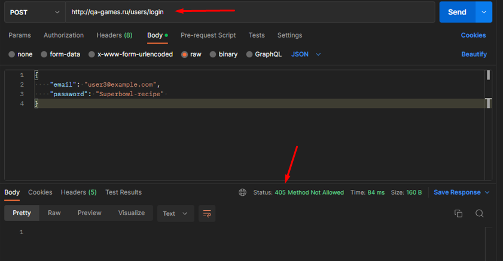

=  Баг-репорт   01_middle  

== Неправильно именован эндпоинт

=== Описание: 
В контракте не указан эндпоинт. Запросы, отправленные к корневому маршруту, выдают ошибку 405. Фактический эндпоинт http://qa-games.ru:9000/

=== Шаги к воспроизведению:
. Отправить POST-запрос с валидным телом на авторизацию (маршрут http://qa-games.ru/users/login)

=== Ожидаемый результат:
Получен ответ статус 200 ОК, Header Set-Cookie - token=jwt

=== Фактический результат:
Получен ответ 405 Method Not Allowed

=== Статус: 
открыт 24.12.2022

==== Автор:
Долгополова Светлана

=== Окружение:
ОС Windows 10 Pro v21H2 19044.2364
Браузер Google Chrome Версия 108.0.5359.125

=== Проект:
http://qa-games.ru

=== Версия:
1.2.0

=== Требования:
https://notion.so/http-qa-games-ru-bad51e16b66b403eb3a734e2ad6f5fa9[]

=== Приоритет:
значительный

=== Приложения:

Возвращает ошибку 405:
[source,lang]
curl --location --request POST 'http://qa-games.ru' \
--header 'Content-Type: application/json' \
--data-raw '{
    "email": "user3@example.com",
    "password": "Superbowl-recipe" 
}'

С таким эдпоинтом всё работает:
[source,lang]
curl 'http://qa-games.ru:9000/users/login' \
  -H 'Accept: application/json, text/plain, */*' \
  -H 'Referer: http://qa-games.ru/' \
  -H 'User-Agent: Mozilla/5.0 (Windows NT 10.0; Win64; x64) AppleWebKit/537.36 (KHTML, like Gecko) Chrome/108.0.0.0 Safari/537.36' \
  -H 'Content-Type: application/json' \
  --data-raw '{"email":"user3@example.com","password":"Superbowl-recipe"}' \
  --compressed \
  --insecure

