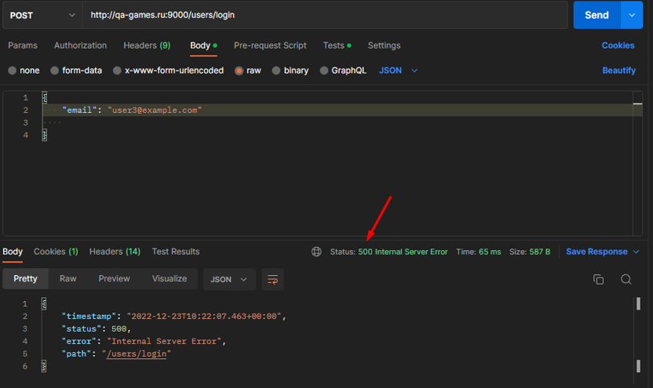

=  Баг-репорт   02_back

== При отправке запроса на авторизацию с невалидным телом возвращается ответ с кодом 500
Примечание: Согласно документации, должно работать на http://qa-games.ru, но сейчас из-за бага № 01_middle работает на http://qa-games.ru:9000. Пока баг не пофиксят, проверять на нём.

=== Описание: 
При отправке запроса на авторизацию с отсутствием в теле обязательного  поля password возвращается ответ с неверным кодом 
=== Шаги к воспроизведению:
. Отправить POST-запрос на авторизацию с невалидным телом (присутствует только поле email).

=== Ожидаемый результат:
Получен ответ статус 400 Bad Request

=== Фактический результат:
Получен ответ 500 Internal Serwer Error

=== Статус: 
открыт 24.12.2022

==== Автор:
Долгополова Светлана

=== Окружение:
ОС Windows 10 Pro v21H2 19044.2364

=== Проект:
http://qa-games.ru

=== Версия:
1.2.0

=== Требования:
https://notion.so/http-qa-games-ru-bad51e16b66b403eb3a734e2ad6f5fa9[]

=== Приоритет: 
значительный

=== Приложения:
[source,lang]
curl --location --request POST 'http://qa-games.ru:9000/users/login' \
--header 'Content-Type: application/json' \
--data-raw '{
    "email": "user3@example.com"
}'

