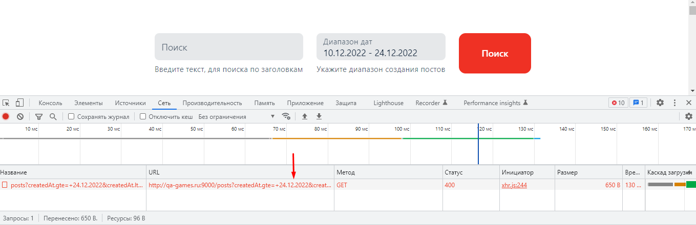

=  Баг-репорт   08_front  

== При попытке поиска поста по дате создания в  отправляемом запросе даты в параметрах указываются в неправильном формате 
Примечание: Согласно документации, должно работать на http://qa-games.ru, но сейчас из-за бага № 01_middle работает на http://qa-games.ru:9000. Пока баг не пофиксят, проверять на нём.

=== Описание: 
При попытке поиска поста по дате создания в ручку GET/posts передаются даты не в формате ISO Date Time Format, поэтому запрос не работает (отдаёт 400)

=== Шаги к воспроизведению:
. Авторизоваться.
. Заполнить поле Диапазон дат валидными значениями.
. Нажать Поиск.

=== Ожидаемый результат:
Получены посты в соответствии с заданным диапазоном создания. В параметрах запроса даты преобразованы в формат, соответствующий требованиям (ISO Date Time Format).

=== Фактический результат:
В параметрах запроса даты передаются в неверном формате.

=== Статус: 
открыт 24.12.2022

==== Автор:
Долгополова Светлана

=== Окружение:
ОС Windows 10 Pro v21H2 19044.2364
Браузер Google Chrome Версия 108.0.5359.125

=== Проект:
http://qa-games.ru

=== Версия:
1.2.0

=== Требования:
https://notion.so/http-qa-games-ru-bad51e16b66b403eb3a734e2ad6f5fa9[]

=== Приоритет: значительный

=== Приложения:
[source,lang]
curl 'http://qa-games.ru:9000/posts?createdAt.gte=+24.12.2022&createdAt.lte=10.12.2022+' \
  -H 'Accept: application/json, text/plain, */*' \
  -H 'Referer: http://qa-games.ru/' \
  -H 'User-Agent: Mozilla/5.0 (Windows NT 10.0; Win64; x64) AppleWebKit/537.36 (KHTML, like Gecko) Chrome/108.0.0.0 Safari/537.36' \
  --compressed \
  --insecure
  

