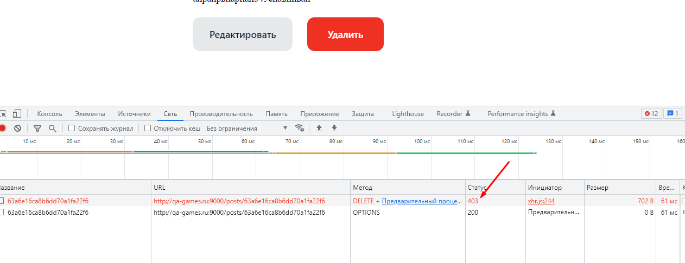

=  Баг-репорт   09_front  

== При попытке удаления поста другого автора фронт работает некорректно. 
Примечание: Согласно документации, должно работать на http://qa-games.ru, но сейчас из-за бага № 01_middle работает на http://qa-games.ru:9000. Пока баг не пофиксят, проверять на нём.

=== Описание: 
При нажатии на кнопку Удалить у поста другого автора пост пропадает из ленты, но на самом деле не удаляется и при обговлении страницы снова появляется в ленте.

=== Шаги к воспроизведению:
. Авторизоваться.
. Нажать кнопку Удалить у поста другого автора.

=== Ожидаемый результат:
Пост не удаляется и не пропадает из ленты; отображается сообщение об ошибке.

=== Фактический результат:
Пост пропадает из ленты, но на самом деле не удаляется и при обговлении страницы снова появляется в ленте.

=== Статус: 
открыт 24.12.2022

==== Автор:
Долгополова Светлана

=== Окружение:
ОС Windows 10 Pro v21H2 19044.2364
Браузер Google Chrome Версия 108.0.5359.125

=== Проект:
http://qa-games.ru

=== Версия:
1.2.0

=== Требования:
https://notion.so/http-qa-games-ru-bad51e16b66b403eb3a734e2ad6f5fa9[]

=== Приоритет: значительный

=== Приложения:

